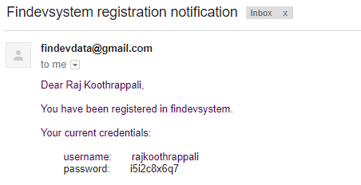
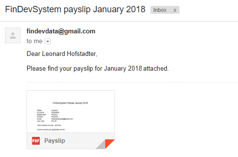
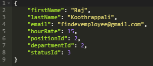
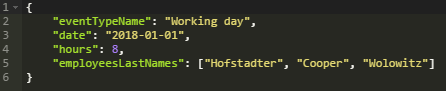
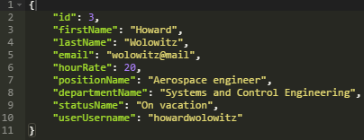

# FinDevSystem

Is a back-end RESTfull server application for staff management and financial accounting. As a management instrument it allows to create daily events and assign relevant  employees. FinDevSystem stores in database information about all employees and events they took part in. Financial component provides for calculation of employees' monthly salaries and scheduled auto mailing of payslips.

Link to web server: [FinDevSystem](https://findevsystem.herokuapp.com/swagger-ui.html)

## Access
There are available following levels of access:
- **administrator** (unlimited access including controlling access roles, assigning moderators, etc)
- **moderator** (creating and editing employees and events data)
- **user** (viewing own data)

### Events
Moderator creates events on daily basis. System allows to add one or more free employees as participants of the event. Employees can have the following statuses:
- **free** (availeble to take part in event)
- **busy** (taking part in another event already)
- **on sick leave** (not available)
- **on vacation** (not available)

Each event contains its type, date and duration (in hours).

### Employee
Upon registration each employee receives an e-mail notification. Login consists of lowercase combination of the first and last names of the employee. Password is automatically generated however can be changed by the employee afterwards.

Information about employee:
- first name
- last name
- e-mail
- department
- position
- hourly rate
- status

At the beginning of each month an employee receives on mail pdf [payslip](/documents/PayslipSample.pdf) containing  salary amount for previous month and listed events the employee took part in accordingly. Employee's salary is calculated based on hourly rate, time spent and events types.

Additionally, each employee has access in the system to his data and income per any period of time. 

> Note: Use the following date format: `yyyy-MM-dd`

### Moderator
Moderator registers new employees in the system:

 `/employees`

Creates new events:

 `/events`

Can view information about each employee:

 `/employees/{employeeId}`

Can view income of each employee per specified period of time:

 `/income?firstName={firstName}&lastName={lastName}&dateFrom={dateFrom}&dateTo={dateTo}`

### Database

All data is stored in relational database ([see tables overview](/documents/MySQLDiagram.pdf)). Tables are linked with ManyToOne and ManyToMany relationships.

### Technical overview
App [architecture](/documents/UMLDiagram.pdf) is build in accordance with MVC design pattern.

Tech stack:

- Java
- MySQL
- Spring Boot
- Maven
- Git
- Heroku + ClearDB
- Swagger
- JavaMail + PDFBox